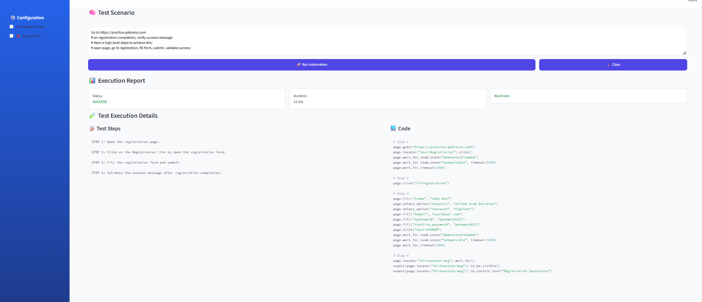
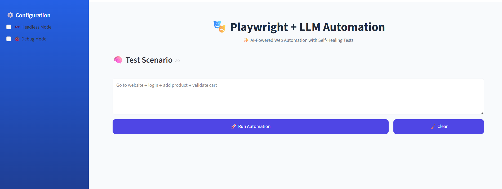

# Playwright + LLM: Intelligent Web Automation Framework

An AI-powered web automation framework that combines **Playwright** (browser automation) with **LLM** (Large Language Models) to intelligently generate, execute, and fix test automation code in real-time. This project automates complex web workflows by letting LLMs understand the DOM, generate Playwright code dynamically, and intelligently handle errors.

---

## ⚡ Quick Start (5 minutes)

```bash
# 1. Setup
python -m venv .venv
.venv\Scripts\activate
pip install -r requirements.txt
playwright install

# 2. Configure
cp .env.example .env
# Edit .env and add your OPENAI_API_KEY

# 3. Run Streamlit UI 🎨
streamlit run ui/streamlit_app.py
```

Then open **http://localhost:8501** and start automating!

---

## 📑 Table of Contents

1. [Quick Start](#-quick-start-5-minutes)
2. [What This Project Does](#-what-this-project-does)
3. [Key Advantages](#-key-advantages)
4. [How It Works](#-how-it-works)
5. [Project Architecture](#-project-architecture)
6. [Project Structure](#-project-structure)
7. [Setup Instructions](#-setup-instructions)
8. [Configuration](#%EF%B8%8F-configuration)
9. [Running the Project After Setup](#-running-the-project-after-setup)
10. [Streamlit UI Guide](#-streamlit-ui-guide)
11. [Code Examples](#-code-examples)
12. [References](#-references--external-documentation)

---

## 🎯 What This Project Does

This project builds an **intelligent web automation system** that:

- **Automates complex web workflows** (e-commerce flows, form filling, multi-step interactions)
- **Dynamically generates Playwright code** using LLM (GPT-4o-mini) based on actual DOM elements
- **Automatically fixes failing tests** by analyzing errors and regenerating corrected code
- **Understands test scenarios** and executes them step-by-step with memory/history tracking
- **Extracts smart DOM representation** focusing on interactive/important elements only

**Real-world use case:**
```
Scenario: "Validate add to cart flow on e-commerce site"
→ System goes to site → Logs in → Finds first product → Adds to cart → Validates success
✨ All code generated by LLM without manual test script writing
```

---

## 💡 Key Advantages of LLM-Powered Automation

### 1. **No Manual Test Scripts**
- Instead of writing Playwright code manually, describe what you want to do (scenario)
- LLM generates the complete code automatically based on the live DOM

### 2. **Self-Healing Tests**
- Tests fail? LLM analyzes the error and **automatically fixes the code**
- Handles selector ambiguity, element visibility, dynamic UI changes

### 3. **Smart DOM Understanding**
- System extracts only **important/interactive elements** (buttons, inputs, forms, links)
- Reduces noise and focuses LLM on actionable elements
- Intelligent selector strategy (ID → data-testid → name → placeholder → text)

### 4. **Context-Aware Execution**
- LLM maintains **execution history** to avoid repeating actions
- Understands what's already been done and proceeds to next logical step
- No need to write conditional logic

### 5. **Reduced Test Maintenance**
- UI changes? Tests adapt automatically
- No need to update selectors manually for every UI change
- Scales to multiple web applications

---

## 🔄 How It Works

```
┌─────────────────────────────────────────────────────────────────┐
│                    PLAYWRIGHT + LLM PIPELINE                    │
└─────────────────────────────────────────────────────────────────┘

1️⃣ LAUNCH BROWSER & NAVIGATE
   └─> Playwright opens browser and navigates to target URL

2️⃣ EXTRACT DOM TREE
   └─> page_functions.extract_dom_tree() scans DOM
   └─> Filters: Keeps inputs, buttons, links, forms + their hierarchy
   └─> Returns: Structured JSON of important elements only

3️⃣ GENERATE ACTION CODE (CODE WEAVER)
   Input: [Current DOM Elements] + [Scenario Description] + [Step History]
   └─> code_weaver/agent.py → calls GPT-4o-mini
   └─> Prompt: "Based on DOM, scenario, and history, generate next step"
   └─> Output: Python code + description + status

4️⃣ EXECUTE CODE
   └─> Execute generated Python code on the page
   └─> Track what happened in history

5️⃣ ERROR HANDLING & REPAIR (CODE MENDER)
   If execution fails:
   └─> code_mender/agent.py → calls GPT-4o-mini again
   └─> Prompt: "Fix this code based on error message"
   └─> Output: Corrected Python code
   └─> Retry execution

6️⃣ LOOP UNTIL COMPLETE
   └─> Repeat steps 2-5 until scenario is complete or fails
   └─> Status indicates: COMPLETE ✅ or FAIL ❌

┌─ Status Meanings ─────────┐
│ COMPLETE = Goal achieved  │
│ FAIL = Test failed        │
│ AWAITING = Keep going     │
└───────────────────────────┘
```

---

## 🏗️ Project Architecture

```
COMPONENTS:

backend/
  ├── llm/               ← LLM Integration
  │   ├── client.py              # OpenAI client setup
  │   ├── utils.py               # Response parsing
  │   └── __init__.py
  │
  ├── agents/            ← Two Specialized Agents
  │   ├── code_weaver/           # Generates step code from DOM
  │   │   ├── agent.py           # generate_step_code()
  │   │   ├── prompt.py          # Weaver prompt template
  │   │   └── __init__.py
  │   │
  │   └── code_mender/           # Fixes broken code
  │       ├── agent.py           # fix_error_code_with_llm()
  │       ├── prompt.py          # Mender prompt template
  │       └── __init__.py
  │
  ├── playwright/        ← Browser Integration
  │   ├── page_functions.py      # extract_dom_tree(), wait_for_dom_change()
  │   └── __init__.py
  │
  ├── utils/             ← Utilities
  │   ├── logger.py              # add_debug_logs()
  │   └── __init__.py
  │
  └── test_executor.py   ← Main Execution Engine
                               # Contains run() - main orchestrator

main.py                   ← Entry point
test.py                   ← Testing/Debugging
requirements.txt          ← Dependencies
pyproject.toml           ← Project metadata
```

---

## 🎨 Streamlit Web Interface

We provide a beautiful, clean Streamlit application for easy automation management - designed for simplicity and focus.

### Features:

**Visual Design:**
- 🎨 Gradient purple-blue theme
- 🌈 Colorful status badges (success/error)
- 📱 Responsive layout for desktop & tablet
- ✨ Clean, minimal interface

**Functionality:**
- 📝 Simple text area for scenario input
- ⚙️ Configuration sidebar (headless mode, debug logs)
- 🚀 Single "Run Automation" button
- 📊 **Results Display with 3 Tabs:**
  - **📝 Manual Steps**: Execution history showing all steps followed
  - **💻 Generated Code**: All generated Playwright code with expandable details
  - **📊 Final Result**: Summary report and final output
- 🔄 **Clear Button** - Reset and start fresh

**Usage:**
```bash
# Recommended - Simplified UI (Latest)
.venv\Scripts\streamlit run ui/streamlit_app_run.py

# Alternative - Full-featured UI
streamlit run ui/streamlit_app.py
```

Then open http://localhost:8501 in your browser

---

### Streamlit UI Walkthrough (streamlit_app_run.py)

**On Load:**
1. Configure sidebar with Headless Mode & Debug Logs toggles
2. Title: "🎭 Playwright + LLM Automation"
3. Subtitle: "✨ AI-Powered Web Automation with Self-Healing Tests"
4. Test Scenario text area with example
5. "🚀 Run Automation" button

**After Clicking Run:**
1. Status badge shows ✅ Success or ❌ Failed
2. Three metrics displayed: Total Steps, Duration, Status
3. Three result tabs appear:

**Tab 1: Manual Steps (📝)**
```
Step 1: Navigate to login page
Step 2: Fill email test@example.com
Step 3: Fill password
Step 4: Click login button
Step 5: Validate success message
```

**Tab 2: Generated Code (💻)**
```
Step 1: Navigate to login page
  └─ ✅ Executed successfully on first try
  └─ Code: page.goto("https://example.com/login")

Step 2: Fill email field
  └─ 🔧 Auto-fixed after initial failure
  └─ Code: page.fill("#email", "test@example.com")

(Expandable sections for each step)
```

**Tab 3: Final Result (📊)**
```
Summary Table:
├─ Overall Status: SUCCESS
├─ Total Steps: 5
├─ Duration: 42.5s
├─ Scenario: Go to https://... (truncated)

Final Output: [Result of last step]
```

4. "🔄 Clear Report" button to reset

---

## 🖼️ Visual Walkthrough - Real Screenshots

### **1. Main Interface - Configuration & Input**

When you first launch the Streamlit app, you'll see:

**Sidebar (Left Panel - Blue):**
- ⚙️ Configuration section with toggles:
  - ☑️ **Headless Mode** - Run browser visible or hidden
  - ☑️ **Debug Mode** - Enable detailed logging

**Main Area (Center):**
- 🎭 Title: "Playwright + LLM Automation"
- ✨ Subtitle: "AI-Powered Web Automation with Self-Healing Tests"
- 💬 **Test Scenario** textarea with example:
  ```
  Go to website -> login -> add product -> validate cart
  ```
- 🚀 **Run Automation** button (large, prominent)
- 🔄 **Clear** button (right side)

**Example Input:**
```
Go to practice.upbrainme.com
Click on Registration link
Fill the registration form with:
  - Name: John Doe
  - Country: United Arab Emirates
  - Account Type: Engineer
  - Email: user@user.com
  - Password: password123
  - Confirm Password: password123
Click Sign Up button
Validate success message showing "Registration Successful"
```

---

### **2. Execution Report - Results Panel**



After clicking "Run Automation", you'll see the results appear in three tabs:

**Status & Metrics (Top):**
- 📊 **Status**: ✅ SUCCESS (or ❌ FAILED)
- ⏱️ **Duration**: 33.75s (example)
- ✔️ **No Errors** (green badge)

**Tab 1: Test Steps (📝)**
Displays the execution history showing each step:
```
STEP 1: Open the registration page.
STEP 2: Click on the Registration link to open the registration form.
STEP 3: Fill the registration form and submit.
STEP 4: Validate the success message after registration.
```

**Tab 2: Code (💻)**
Shows the generated Playwright code for each step with syntax highlighting:
```python
# Step 1
page.goto("https://practice.upbrainme.com")
page.locator("text=Registration").click()
page.wait_for_load_state("networkidle", timeout=5000)
page.wait_for_timeout(2000)

# Step 2
page.click("#registration")

# Step 3
page.fill("name", "John Doe")
page.select_option("#country", "United Arab Emirates")
page.select_option("#account", "Engineer")
page.fill("#email", "user@user.com")
page.fill("#password", "password123")
page.fill("#confirm_password", "password123")
page.click("text=SIGNUP")
page.wait_for_load_state("domcontentloaded")
page.wait_for_timeout(2000)

# Step 4
page.locator("#livsuccess-msg").wait_for(state="visible")
expect(page.locator("#livsuccess-msg")).to_contain_text("Registration Successful")
page.wait_for_load_state("domcontentloaded")
page.wait_for_timeout(2000)
```

---

## 💡 How to Use - Step by Step

### **Main Interface Screenshot**



---

### 1. **Enter Your Test Scenario**
Write a natural language description of what you want to automate:
```
✏️ Navigate to company website
✏️ Log in with credentials
✏️ Search for product
✏️ Add to cart
✏️ Validate cart count
```

No Playwright code needed! LLM handles the implementation.

### 2. **Configure Settings (Optional)**
- **Headless Mode**: ✅ for faster execution (no browser window), ❌ to watch it run
- **Debug Mode**: ✅ to see detailed logs, ❌ for clean output

### 3. **Click "Run Automation"**
The system will:
1. 🔍 Extract live DOM from specified website
2. 🤖 Generate Playwright code for each step
3. ⚙️ Execute the code
4. 🔧 Auto-fix any failures
5. 📊 Display results

### 4. **Review Results**
- **Test Steps Tab**: See what actions were taken
- **Code Tab**: Review the generated code
- **Final Result**: Check overall status

### 5. **Clear & Try Again**
Click the "🔄 Clear" button to reset and run a new scenario.

---

```
playwright-with-llm/
│
├── main.py                       # Entry point
├── test.py                       # Test file
├── pyproject.toml               # Project config (Python 3.10+)
├── requirements.txt             # Dependencies
├── README.md                    # This file
│
├── ui/                          # 🎨 Streamlit UI
│   ├── __init__.py
│   ├── streamlit_app_run.py     # 🎨 Simplified, clean UI (RECOMMENDED)
│   └── streamlit_app.py         # Full-featured UI (legacy)
│
└── backend/
    ├── __init__.py
    ├── test_executor.py         # 🎯 Core orchestrator (Windows asyncio fix included)
    │
    ├── agents/
    │   ├── __init__.py
    │   ├── code_weaver/         # Step Code Generator
    │   │   ├── __init__.py
    │   │   ├── agent.py         # generate_step_code()
    │   │   └── prompt.py        # Prompt template
    │   │
    │   └── code_mender/         # Error Fix Agent
    │       ├── __init__.py
    │       ├── agent.py         # fix_error_code_with_llm()
    │       └── prompt.py        # Prompt template
    │
    ├── llm/
    │   ├── __init__.py
    │   ├── client.py            # OpenAI API setup (loads .env)
    │   ├── utils.py             # Response parsing
    │   └── __pycache__/
    │
    ├── playwright/
    │   ├── __init__.py
    │   ├── page_functions.py    # DOM extraction & manipulation
    │   └── __pycache__/
    │
    ├── utils/
    │   ├── __init__.py
    │   ├── logger.py            # add_debug_logs() with .env check
    │   └── __pycache__/
    │
    └── __pycache__/
```

---

## 🚀 Setup Instructions

### Step 1: Clone & Navigate

```bash
cd d:\Codebase\Playwright_With_LLM
```

### Step 2: Create Virtual Environment

```bash
# Using uv (recommended, faster)
uv venv
.venv\Scripts\activate

# Or using Python directly
python -m venv .venv
.venv\Scripts\activate
```

### Step 3: Install Dependencies

**Option A: Using uv (recommended)**
```bash
uv sync
```

**Option B: Using pip**
```bash
pip install -r requirements.txt
```

### Step 4: Install Playwright Browsers

```bash
playwright install
```

This downloads the Chromium, Firefox, and WebKit browsers needed for automation.

### Step 5: Set Environment Variables

Create a `.env` file in the project root (copy from `.env.example`):

```bash
cp .env.example .env
```

Then edit `.env` and add your OpenAI API key:

```env
OPENAI_API_KEY=your_openai_api_key_here
OPENAI_API_BASE=https://api.openai.com/v1
DEBUG=False
```

Get your OpenAI API key from: https://platform.openai.com/api-keys

**DEBUG Flag Behavior:**
- **When running backend directly**: Uses `DEBUG` value from `.env`
  ```python
  python backend/test_executor.py
  DEBUG = False  # Uses .env value
  ```
- **When running Streamlit**: The checkbox in sidebar overrides `.env` value
  ```bash
  streamlit run ui/streamlit_app.py
  DEBUG = [checkbox value]  # Overrides .env
  ```

### Step 6: Launch the Streamlit UI (Optional but Recommended)

```bash
streamlit run ui/streamlit_app.py
```

The app will open at `http://localhost:8501` automatically in your browser!

## ⚙️ Configuration

### Streamlit UI Configuration

The Streamlit web interface provides easy configuration through the sidebar:

1. **🤫 Headless Mode**: Check to run browser without GUI window
2. **🐛 Enable Debug Logs**: Check to see detailed execution logs (overrides `.env` DEBUG value)
3. **Scenario Input**: Enter your test scenario in the main text area
4. **API Status**: Sidebar shows if OpenAI API is configured

**How DEBUG Flag Works:**
- **In Streamlit UI**: Debug checkbox overrides the `DEBUG` value from `.env`
  - This gives you full control when running via UI
  - Each run can have different debug settings
- **In backend code**: When `debug=None` (not explicitly set), uses `DEBUG` from `.env`
  - Keep `DEBUG=False` in `.env` for production runs
  - Change to `DEBUG=True` for local debugging

**Custom Scenario Format:**
```
Go to [URL]
[Goal/Description]
Here is high level steps to achieve this:
step 1, step 2, step 3, etc.
```

### Terminal Mode Configuration (test_executor.py)

For command-line execution, the system reads `DEBUG` from `.env`:

```python
# File: backend/test_executor.py

# Reads DEBUG from .env
result = run(
    scenario="Go to https://...",
    debug=None  # None means use DEBUG from .env
)

# Or explicitly override .env
result = run(
    scenario="Go to https://...",
    debug=True  # Explicitly enable debug
)
```

### Customize LLM Prompts

Adjust how the LLM generates and fixes code:

- **Code Weaver Prompt**: [backend/agents/code_weaver/prompt.py](backend/agents/code_weaver/prompt.py)
- **Code Mender Prompt**: [backend/agents/code_mender/prompt.py](backend/agents/code_mender/prompt.py)

Both prompts are highly configurable for different scenarios and requirements.

---

## ▶️ Running the Project After Setup

Once you've completed the setup steps, you're ready to run automation! Choose the option that best fits your needs:

### 🎨 Option 1: Streamlit UI (RECOMMENDED) - Clean & Simple

The easiest and most visual way to run automation with a beautiful, focused web interface.

**How to Run:**
```bash
# Recommended - Clean, simplified UI
.venv\Scripts\streamlit run ui/streamlit_app_run.py

# Or use direct streamlit command (requires activation)
streamlit run ui/streamlit_app_run.py
```

**Expected Output:**
```
You can now view your Streamlit app in your browser.

Local URL: http://localhost:8501
Network URL: http://192.168.x.x:8501
```

**What You'll See:**
1. 🎭 Title: "Playwright + LLM Automation"
2. ✨ Subtitle: "AI-Powered Web Automation with Self-Healing Tests"
3. ⚙️ Sidebar with Configuration (Headless, Debug)
4. 📝 Test Scenario text area with example
5. 🚀 Run Automation button

**After Execution - 3 Result Tabs:**

| Tab | Shows |
|-----|-------|
| 📝 **Manual Steps** | Execution history - all steps followed in order |
| 💻 **Generated Code** | All Playwright code blocks with expandable details |
| 📊 **Final Result** | Summary report, metrics, and final output |

**Features:**
- ✅ Ultra-clean interface focused on execution
- ✅ Metrics display: Steps, Duration, Status
- ✅ Status badges: ✅ Success or ❌ Failed
- ✅ Auto-fix indicators (🔧) on code blocks
- ✅ Error details for debugging
- ✅ Clear Report button to reset

---

### 🐍 Option 2: Python Script - Integration & Automation

Run automation from your own Python code or automated workflows.

**How to Run:**

Edit `main.py` with your scenario:

```python
from backend.test_executor import run

# Define your test scenario
scenario = """
Go to https://example.com/login
Complete login flow
Steps: fill email, password, click login, validate success
"""

# Execute automation
result = run(
    scenario=scenario,
    headless=False,  # False = show browser, True = hidden
    debug=True       # True = verbose logs, False = minimal
)

# Process results
print(f"✅ Status: {result['status']}")
print(f"📍 Steps: {result['total_steps']}")
print(f"⏱️  Duration: {result['duration']}")

# Show execution history
for i, step in enumerate(result['history'], 1):
    print(f"  {i}. {step}")

# Show generated code
for block in result['generated_code']:
    status = "🔧 Fixed" if block.get('is_fixed') else "✅ OK"
    print(f"  Step {block['step_number']}: {block['description']} [{status}]")
```

Then run:
```bash
python main.py
```

**Use Cases:**
- 🔄 CI/CD pipelines - integrate into continuous testing
- ⏲️ Scheduled tasks - run on a timer
- 🔗 Complex workflows - chain multiple scenarios
- 📦 Batch testing - run multiple tests programmatically

---

### 💻 Option 3: Terminal/CLI - Quick Testing

Direct execution from command line (requires scenario in code).

**How to Run:**
```bash
python backend/test_executor.py
```

**What Happens:**
1. 🌐 Browser launches
2. 🔍 Navigates to URL in scenario
3. 🤖 LLM generates code for each step
4. ⚙️ Executes generated Playwright code
5. 🔧 Auto-fixes failures if any occur
6. ✅ Displays final status

**Best for:**
- 🔨 Quick debugging
- 🧪 Testing without UI overhead
- 🚀 CI/CD environments
- 👀 Real-time execution flow observation

---

### 🐛 Debug Logging

**How to Enable Debug Logs:**

In Streamlit (Recommended):
- ✅ Check "🐛 Enable Debug Logs" checkbox in sidebar
- Shows detailed DOM, prompts, generated code, errors

In Python:
```python
# Enable debug
result = run(scenario="...", debug=True)

# Disable debug
result = run(scenario="...", debug=False)

# Use .env value
result = run(scenario="...", debug=None)  # Uses DEBUG from .env
```

In .env:
```env
DEBUG=True     # Development: verbose logs
DEBUG=False    # Production: clean output
```

**Debug Output Includes:**
- 🔍 DOM elements extracted from page
- 💭 LLM prompts and responses
- 💻 Generated code before execution
- ⚠️ Detailed error messages
- 🔧 Auto-fix attempts and corrections

---

### 🪟 Windows-Specific Notes

**Asyncio Event Loop:**
- The project includes a fix for Windows asyncio+Streamlit compatibility
- Automatically uses `WindowsSelectorEventLoopPolicy` on Windows
- No manual configuration needed

**Playwright Browsers:**
```bash
# Make sure Playwright browsers are installed
playwright install

# If issues, reinstall with --with-deps
playwright install --with-deps
```

---

## 🎨 Streamlit UI Guide

### Starting the Streamlit App

Once you've completed setup, launching the Streamlit UI is simple:

```bash
# From project root, activate environment (if not already active)
.venv\Scripts\activate

# Run the Streamlit app
streamlit run ui/streamlit_app.py
```

**What You'll See:**
```
You can now view your Streamlit app in your browser.

Local URL: http://localhost:8501
Network URL: http://192.168.1.100:8501
External URL: http://your-ip:8501

Rerun script through browser
```

The browser should open automatically. If not, manually navigate to **http://localhost:8501**

---

### UI Walkthrough: Step by Step

**Step 1: Configure Your Execution**
```
Left Sidebar:
┌─ ⚙️ Configuration
│  ├─ 🤫 Headless Mode  [Toggle checkbox]
│  │  └─ Unchecked = See browser window (slower)
│  │     Checked = Run hidden (faster)
│  │
│  └─ 🐛 Enable Debug Logs  [Toggle checkbox]
│     └─ Unchecked = Clean output (production)
│        Checked = Verbose logs (debugging)
```

**Step 2: Enter Your Scenario**
```
Main Content Area:
📝 Test Scenario (large text area)
├─ Default: Pre-filled with example scenario
├─ Edit: Replace with your own test steps
└─ Format: Go to [URL], then describe what you want to do
```

**Step 3: Run Automation**
```
Action Buttons:
✭ 🚀 Run Automation      ← Click to execute
✭ 🔄 Clear Results       ← Remove previous results
✭ ℹ️ Show Info           ← Display workflow info
```

**Step 4: View Results in 4 Tabs**

After execution completes, results appear in tabs:

**Tab 1: 📋 Overview**
```
Status: ✅ PASSED
━━━━━━━━━━━━━━━━━━━
⏱️  Duration: 42.5 seconds
🔄 Steps Completed: 5
🎯 Final Step: Validated success message
```

**Tab 2: 📝 Steps Followed**
```
1. ✅ Navigated to login page - SUCCESS
2. ✅ Filled email field - SUCCESS
3. ✅ Filled password field - SUCCESS
4. ✅ Clicked login button - SUCCESS
5. ✅ Validated success message - SUCCESS
```

**Tab 3: 💻 Generated Code E2E**
```
🔹 Step 1: Navigate to login page
   └─ Code: page.goto("https://example.com/login")
   └─ Status: ✅ Executed Successfully

🔹 Step 2: Fill email field
   └─ Code: page.fill("#email_input", "test@example.com")
   └─ Status: 🔧 Fixed (Auto-corrected)
   └─ Error was: selector not found

... (more code blocks)
```

**Tab 4: 📊 Test Status**
```
Overall Result: ✅ TEST PASSED
━━━━━━━━━━━━━━━━━━━━━━
├─ Status: SUCCESS
├─ Total Steps: 5
├─ Duration: 42.5s
├─ Auto-Fixes: 1
└─ Errors: 0

Final Step Description:
Validated that success message appears after login
```

---

### UI Layout Diagram (streamlit_app_run.py)

```
┌──────────────────────────────────────────────────────────────────────┐
│                    🎭 Playwright + LLM Automation                    │
│            ✨ AI-Powered Web Automation with Self-Healing Tests     │
├────────────────────────┬─────────────────────────────────────────────┤
│ 🔵 LEFT SIDEBAR        │ 📄 MAIN CONTENT AREA                       │
│ (Blue Background)      │                                             │
├────────────────────────┼─────────────────────────────────────────────┤
│                        │                                             │
│ ⚙️ Configuration       │ 💬 Test Scenario                           │
│  ☑ Headless Mode      │ ┌────────────────────────────────────────┐ │
│  ☑ Debug Mode         │ │ Go to website -> login -> add product  │ │
│                        │ │ -> validate cart                       │ │
│                        │ │                                        │ │
│                        │ │                                        │ │
│                        │ └────────────────────────────────────────┘ │
│                        │                                             │
│                        │ 🎯 Action Buttons                          │
│                        │  [🚀 Run Automation]  [🔄 Clear]          │
│                        │                                             │
│                        │ ═════════════════════════════════════════ │
│                        │ 📊 RESULTS (After Execution)              │
│                        │ ═════════════════════════════════════════ │
│                        │                                             │
│                        │ Status: ✅ SUCCESS    Duration: 33.75s     │
│                        │ No Errors                                   │
│                        │                                             │
│                        │  📝 Manual Steps │ 💻 Code │ 📊 Result    │
│                        │  ─────────────────────────────────────     │
│                        │                                             │
│                        │  📝 Tab Content:                           │
│                        │  STEP 1: Navigate to page                 │
│                        │  STEP 2: Fill form                        │
│                        │  STEP 3: Submit form                      │
│                        │  STEP 4: Validate success                 │
│                        │                                             │
└────────────────────────┴─────────────────────────────────────────────┘
```

---

### Layout Components Explained

**Left Sidebar (Blue):**
- 🔵 Fixed blue background (professional look)
- ⚙️ **Configuration** section:
  - ☑️ Headless Mode toggle (show/hide browser)
  - ☑️ Debug Mode toggle (verbose logs on/off)

**Main Content Area (White/Light):**
1. **Header**:
   - 🎭 Title: "Playwright + LLM Automation"
   - ✨ Subtitle: "AI-Powered Web Automation with Self-Healing Tests"

2. **Input Section**:
   - 💬 Large textarea for test scenario description
   - Placeholder with example scenario

3. **Action Buttons**:
   - 🚀 **Run Automation** (primary, full-width, blue)
   - 🔄 **Clear** (secondary, right-aligned, blue)

4. **Results Panel** (appears after execution):
   - 📊 Status badges at top (Success/Failed, Duration, Errors)
   - **3 Tabs** for detailed results:
     - 📝 **Manual Steps**: Execution history
     - 💻 **Generated Code**: Playwright code with syntax highlighting
     - 📊 **Final Result**: Summary and output

---

### Color Scheme & Visual Design

**Gradient Theme (streamlit_app_run.py):**
- 🔵 **Sidebar**: Solid blue (#4B5EFC)
- 🟣 **Buttons**: Purple (#667eea) → Violet (#764ba2)
- 🟢 **Success**: Bright green (#11998e) text badges
- 🔴 **Errors**: Red (#eb3349) text indicators
- ⚪ **Background**: Clean white for main content

**Design Features:**
- ✨ Clean, minimal layout (no clutter)
- 🎨 Large readable text in results
- 📊 Color-coded status indicators
- 📱 Fully responsive (works on all screen sizes)
- ⚡ Fast, minimal re-renders
- 🎯 Single session state (no complex logic)

---

### Common Use Cases

**Use Case 1: Testing E-Commerce Flow**
```
Scenario:
Go to https://practice.qabrains.com/ecommerce
Validate complete purchase flow
Steps: login, find product, add to cart, checkout

Configuration:
  ☑ Headless Mode        (for speed)
  ☐ Debug Logs           (not needed)

Expected Result:
  ✅ 8-10 steps, ~60 seconds
  ✅ All auto-fill and clicks working
  ✅ Success message on order confirmation
```

**Use Case 2: Debugging Login Issues**
```
Scenario:
Go to https://example.com/login
Debug why login fails

Configuration:
  ☐ Headless Mode        (see browser)
  ☑ Debug Logs           (verbose output)

Expected Result:
  🔧 1-2 auto-fixes applied
  ✅ Detailed logs showing each step
  ✅ Error details visible
```

**Use Case 3: Batch Testing**
```
Scenario:
[Run multiple times with different scenarios]
Go to https://api.example.com/test1
Go to https://api.example.com/test2
...

Configuration:
  ☑ Headless Mode        (faster batch)
  ☐ Debug Logs           (minimal output)

Expected Result:
  ✅ All scenarios pass
  📊 Metrics show consistency
  ⏱️ Total time tracked
```

---

### Keyboard Shortcuts

| Key | Action |
|-----|--------|
| `Ctrl+R` | Refresh page |
| `Ctrl+L` | Clear input |
| `Tab` | Navigate fields |
| `Enter` | Submit scenario (if focused) |

---

### Troubleshooting in Streamlit UI

| Problem | Solution |
|---------|----------|
| "Port 8501 already in use" | Change port: `streamlit run ... --server.port 8502` |
| "App not opening in browser" | Manually open http://localhost:8501 |
| "Results not showing" | Check browser console for errors (F12) |
| "Slow execution" | Enable "Headless Mode" checkbox |
| "No debug output" | Check "Enable Debug Logs" checkbox |
| "Rerun script notification" | Click to refresh or wait - temporary |


---

## 💻 Code Examples

### Example 1: How Code Generation Works

**Input DOM (simplified):**
```json
{
  "tag": "BODY",
  "children": [
    {
      "tag": "INPUT",
      "id": "email_input",
      "placeholder": "Enter email",
      "type": "text"
    },
    {
      "tag": "BUTTON",
      "id": "submit_btn",
      "text": "Login"
    }
  ]
}
```

**Scenario:** "Login with email test@example.com and click submit"

**History:** []

**Generated Code by LLM:**
```python
page.fill("#email_input", "test@example.com")
page.click("#submit_btn")
```

**Status:** AWAITING (more steps needed)

---

### Example 2: Error Detection & Auto-Fix

**Initial Code (fails):**
```python
page.fill("input[placeholder='Enter email']", "test@example.com")
page.click("button:text('Login')")
```

**Error:**
```
selector "button:text('Login')" did not resolve to any element
```

**Code Mender Fixes It:**
```python
page.fill("#email_input", "test@example.com")
page.click("#submit_btn")
```

**Reason:** "Used unique IDs instead of text selectors for reliability"

---

### Example 3: Using Modified run() Function

The `run()` function now accepts parameters and returns structured results with full execution history:

```python
from backend.test_executor import run

# Execute with custom scenario
result = run(
    scenario="""
    Go to https://practice.qabrains.com/ecommerce/login
    Validate add to cart flow
    Steps: login, find product, add to cart, verify
    """,
    headless=False,  # Show browser window
    debug=True       # Enable debug logs
)

# Access results
print(f"Status: {result['status']}")           # SUCCESS or FAIL
print(f"Total Steps: {result['total_steps']}")
print(f"Duration: {result['duration']}")

# View all steps followed
print("\n📝 Execution History:")
for i, step in enumerate(result['history'], 1):
    print(f"  {i}. {step}")

# View all generated code blocks
print("\n💻 Generated Code Blocks:")
for code_item in result['generated_code']:
    print(f"\n  Step {code_item['step_number']}: {code_item['description']}")
    print(f"  Code: {code_item['code'][:50]}...")
    if code_item.get('is_fixed'):
        print(f"  ✅ Auto-fixed by Code Mender")
```

**Returned Result Structure:**
```python
{
    "status": "SUCCESS",              # SUCCESS | FAIL
    "description": "Validated checkout", # Final step
    "history": [                      # All steps executed
        "Navigated to login page",
        "Filled email field",
        "Filled password field", 
        "Clicked login",
        "Added product to cart",
        "Validated cart updated"
    ],
    "generated_code": [               # All code blocks with details
        {
            "step_number": 1,
            "description": "Navigate to login",
            "code": "page.goto('https://...')",
            "status": "COMPLETE",
            "is_fixed": False,        # Was auto-corrected?
            "error": None
        },
        ...
    ],
    "duration": "45.2s",              # Total time
    "total_steps": 6
}
```

---

### Example 3: Main Execution Flow

```python
# From backend/test_executor.py

@traceable(name="Chat Pipeline")
def run():
    with sync_playwright() as p:
        browser = p.chromium.launch(headless=False)
        page = browser.new_page()
        
        # Navigate to target
        page.goto("https://practice.qabrains.com/ecommerce/login")
        
        history = []
        
        while True:
            # 1. Extract current DOM
            wait_for_dom_change(page)
            elements = extract_dom_tree(page)
            
            # 2. Generate next step code using LLM
            result = generate_step_code(elements, SCENARIO, history)
            
            # 3. Execute code with retry logic
            execute_code_with_retry(page, result, elements, retry=True)
            history.append(result["description"])
            
            # 4. Check if done
            if result["status"] == "COMPLETE":
                print("✅ TEST PASSED")
                break
            elif result["status"] == "FAIL":
                print("❌ TEST FAILED")
                break
        
        browser.close()

if __name__ == "__main__":
    run()
```

---

## � Example Scenarios

### E-Commerce Testing

**Scenario: Add to Cart Flow**
```
Go to https://practice.qabrains.com/ecommerce/login
Validate add to cart flow for any product
Here is high level steps to achieve this:
open page, login with test@qabrains.com & Password123,
navigate to products, add first product to cart, 
view cart and verify product is added successfully
```

**Scenario: Purchase Checkout**
```
Go to https://practice.qabrains.com/ecommerce/checkout
Complete a purchase flow
Here are the high level steps:
login, select products, proceed to checkout, fill shipping details,
complete payment, validate order confirmation
```

### Form Testing

**Scenario: Registration**
```
Go to https://practice.qabrains.com/register
Complete user registration
Steps:
fill first name, last name, email, password, 
check terms and conditions, submit form,
validate success message appears
```

### Multi-Page Navigation

**Scenario: Search & Filter**
```
Go to https://practice.qabrains.com/products
Search and filter products
Steps:
enter search term, apply filters by price,
sort by rating, verify results displayed correctly
```

### Advanced: Conditional Flows

**Scenario: Dynamic Content Handling**
```
Go to https://example.com/dynamic-page
Test dynamic content interaction
Steps:
wait for page to load, interact with dynamic elements,
handle popup modals if they appear, validate final state
```

---

## �📦 Dependencies

| Package | Purpose |
|---------|---------|
| `playwright` | Browser automation (Chromium, Firefox, WebKit) |
| `openai` | GPT-4o-mini LLM API calls |
| `langchain` | LLM framework & utilities |
| `langsmith` | LangChain observability & tracing |
| `python-dotenv` | Load environment variables |

See `requirements.txt` for all dependencies.

---

## 🔧 Troubleshooting

### General Issues

**Issue:** "OPENAI_API_KEY not found"
- **Solution:** Create `.env` file with `OPENAI_API_KEY=your_key`

**Issue:** "selector did not resolve to any element"
- **Solution:** System auto-fixes this. Check logs to see corrected selector.

**Issue:** "No elements found on page"
- **Solution:** Increase `wait_for_dom_change()` timeout or check URL is loading correctly.

**Issue:** Playwright browser not found
- **Solution:** Run `playwright install` again.

### Streamlit-Specific Issues

**Issue:** "Port 8501 already in use"
- **Solution:** Use different port: `streamlit run ui/streamlit_app.py --server.port 8502`

**Issue:** Streamlit app not opening automatically
- **Solution:** Manually navigate to `http://localhost:8501` in browser

**Issue:** "Module not found" error
- **Solution:** Make sure you're running from project root and virtual environment is activated

**Issue:** "API key configured but automation still fails"
- **Solution:** Verify `.env` file is in project root (same level as `main.py`)

**Issue:** Streamlit page shows "Connection refused"
- **Solution:** Restart Streamlit: `Ctrl+C` and run `streamlit run ui/streamlit_app.py` again

---

## 🎓 Key Concepts

### Code Weaver Agent
- **Purpose:** Generate Playwright code for the next step
- **Input:** DOM elements, scenario, execution history
- **Output:** Python code + description + status
- **LLM:** GPT-4o-mini with temperature=0 (deterministic)

### Code Mender Agent
- **Purpose:** Fix broken Playwright code
- **Input:** Error message, broken code, DOM elements
- **Output:** Fixed Python code + explanation
- **LLM:** GPT-4o-mini with temperature=0

### DOM Extraction
- **Focuses on:** INPUT, BUTTON, A, SELECT, TEXTAREA, LABEL, FORM
- **Filters out:** Non-visible elements, empty containers
- **Smart selectors:** Uses ID → data-testid → name → placeholder → unique text

---

## � References & External Documentation

### Playwright Documentation
- **Official Docs:** https://playwright.dev/python/
- **API Reference:** https://playwright.dev/python/docs/api/class-playwright
- **Selectors Guide:** https://playwright.dev/python/docs/selectors
- **Best Practices:** https://playwright.dev/python/docs/best-practices
- **Debugging:** https://playwright.dev/python/docs/debug

**Key Playwright Methods Used in This Project:**
```python
page.goto(url)                    # Navigate to URL
page.fill(selector, text)         # Fill input field
page.click(selector)              # Click element
page.wait_for_load_state()        # Wait for page state
page.evaluate()                   # Execute JavaScript on page
page.content()                    # Get page HTML
```

---

### OpenAI API Documentation
- **Official API Docs:** https://platform.openai.com/docs/api-reference
- **Models Overview:** https://platform.openai.com/docs/models
- **Chat Completions:** https://platform.openai.com/docs/api-reference/chat/create
- **API Keys:** https://platform.openai.com/api-keys
- **Rate Limits & Pricing:** https://openai.com/pricing

**Models & Costs (as of this project):**
- `gpt-4o-mini` - Fast, cost-effective model used in this project
- `gpt-4o` - More powerful but slower & expensive
- All API calls use `temperature=0` for deterministic responses

**Key OpenAI Client Usage:**
```python
from openai import OpenAI

client = OpenAI(api_key="your_key")
response = client.chat.completions.create(
    model="gpt-4o-mini",
    messages=[{"role": "user", "content": prompt}],
    temperature=0
)
```

---

### LangChain Documentation
- **Official Docs:** https://python.langchain.com/
- **Core Concepts:** https://python.langchain.com/docs/get_started/introduction
- **LLM Integration:** https://python.langchain.com/docs/integrations/llms
- **Agents:** https://python.langchain.com/docs/modules/agents/
- **API Reference:** https://python.langchain.com/docs/api-reference

**Usage in This Project:**
- Provides utilities for LLM integration
- Community tools and parsers
- Helps structure prompts and responses

---

### LangSmith Documentation
- **Official Docs:** https://docs.smith.langchain.com/
- **Getting Started:** https://docs.smith.langchain.com/overview
- **Tracing & Debugging:** https://docs.smith.langchain.com/user_guide
- **Evaluations:** https://docs.smith.langchain.com/evaluation/
- **Dashboards:** https://docs.smith.langchain.com/user_guide/dashboards

**Usage in This Project:**
```python
from langsmith import traceable

@traceable(name="Chat Pipeline")
def run():
    # Your automation code here
    pass
```

**Benefits:**
- Traces all LLM calls and execution paths
- Visualizes complex automation workflows
- Debugging & performance monitoring
- Integration with LangChain ecosystem

---

### Python Environment & Package Management
- **uv Package Manager:** https://github.com/astral-sh/uv
- **Python 3.10+:** https://www.python.org/downloads/
- **pip Documentation:** https://pip.pypa.io/

---

### Related Technologies

#### Web Automation Frameworks
- **Selenium:** Alternative to Playwright (older but widely used)
- **Cypress:** JavaScript-based testing (web)
- **Puppeteer:** Node.js browser automation

#### Alternative LLMs
- **Claude (Anthropic):** https://www.anthropic.com/
- **Mistral:** https://mistral.ai/
- **Local LLMs:** Ollama, LLaMA, etc.

---

### Useful Articles & Resources

1. **LLM-Based Test Automation Concept:**
   - https://www.lambdatest.com/blog/ai-test-automation/
   - https://www.browserstack.com/guide/ai-test-automation

2. **Prompt Engineering Best Practices:**
   - https://platform.openai.com/docs/guides/prompt-engineering
   - https://www.deeplearning.ai/short-courses/chatgpt-prompt-engineering-for-developers/

3. **Web Scraping vs Automation:**
   - Playwright is for **automation** (interact with elements)
   - Not for web scraping (use BeautifulSoup, Scrapy instead)

---

## �📝 License

This project is open source and available under the MIT License.

---

## 🤝 Contributing

Contributions welcome! Feel free to submit issues and enhancement requests.

---

## 📞 Support

For questions or issues, please open a GitHub issue or contact the development team.

